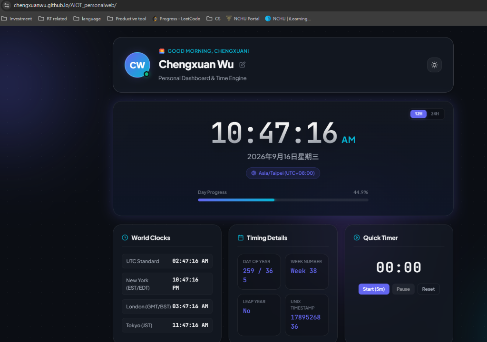

# AIOT Personal Web & Live Timing Dashboard

A modern, responsive personal web dashboard and AIoT portfolio built for edge display terminals and personal branding.

🌐 **Live Demo**: [https://chengxuanwu.github.io/AIOT_personalweb/](https://chengxuanwu.github.io/AIOT_personalweb/)  
🔗 **GitHub Repository**: [https://github.com/ChengxuanWu/AIOT_personalweb](https://github.com/ChengxuanWu/AIOT_personalweb)

---

## 📸 Preview



---

## 📋 Course Assignment Checklist

| Requirement | Implementation Details | Status |
| :--- | :--- | :---: |
| **👤 1. Profile** | Name (Chengxuan Wu), Avatar with initials generator, Academic department (NCHU CSIE & AIoT), specialty badges, and editable bio with local persistence. | ✅ Done |
| **🛠 2. Skills** | Categorized into 4 domains: Programming Languages (Python, C/C++, JS, SQL), AI & ML, IoT & Embedded Systems (ESP32, MQTT), and Web & DevOps. | ✅ Done |
| **🚀 3. Projects** | Showcases 3 projects including AIoT Live Dashboard (with GitHub repo & live demo link), Semester IoT Environmental Telemetry Hub, and Edge AI Vision. | ✅ Done |
| **🕐 4. Live Clock** | Pure JavaScript live digital clock with HH:MM:SS format, 12H/24H toggling, day progress bar, timezone detection, and world clocks. | ✅ Done |
| **🎨 5. Personal Design** | Custom typography, glassmorphism cards, ambient animated gradient orbs, interactive micro-animations, and Light/Dark theme toggle. | ✅ Done |

---

## ✨ Core Features
- **Real-time Live Clock**: Interactive 12H/24H format with continuous 1000ms clock cycle, seconds ticker, and AM/PM badge.
- **Dynamic Greetings**: Time-of-day contextual greetings (Morning, Afternoon, Evening, Night).
- **Timezone & World Clocks**: Auto-detected local timezone with UTC, New York, London, and Tokyo reference clocks.
- **Timing Metrics**: Day of year, ISO week number, leap year detection, and live Unix timestamp ticker.
- **Focus Timer**: Embedded 5-minute countdown widget with pause and reset controls.
- **Technical Skills Matrix**: Interactive skill tags with hover micro-interactions across AI, IoT, and Software engineering.
- **Project Showcase**: Rich project cards highlighting technologies used, status badges, and source links.
- **Aesthetics & Themes**: Modern dark glassmorphism design system, ambient animated gradient orbs, and light/dark theme switch.

---

## 🚀 Getting Started
Simply open `index.html` in any modern web browser or serve it with any static web server:

```bash
# Optional: serve with python
python -m http.server 8000
```
